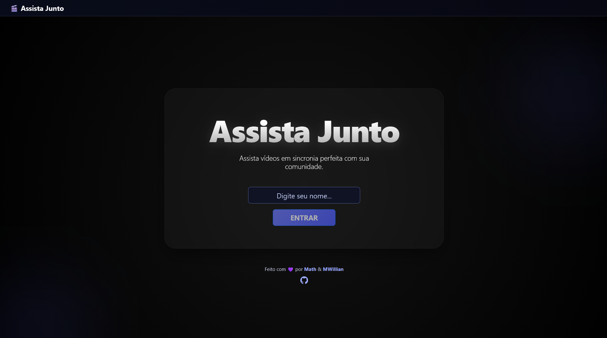
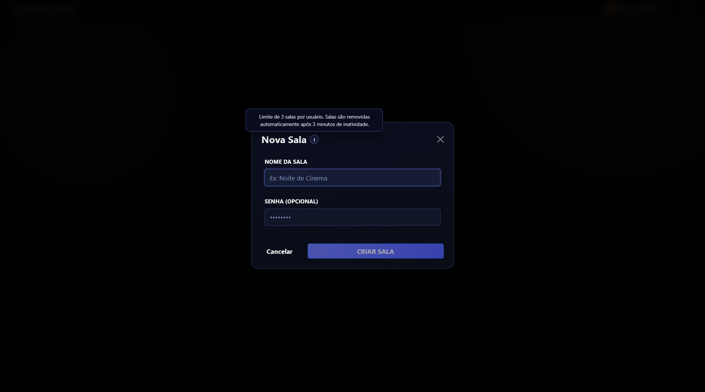
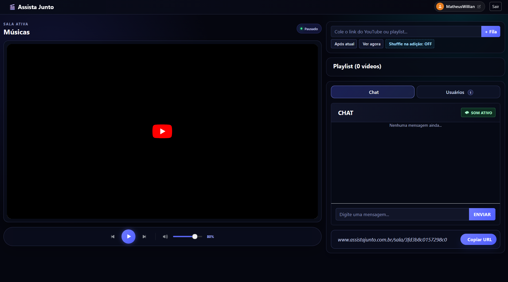

::: {.callout-note icon=false}
## Status do Projeto: **Ativo / Manutenção**
Este projeto está em constante evolução. Desenvolvido em colaboração com [Matheus Rodrigues](https://github.com/ttMath).
:::

## O Projeto

O **Assista Junto** surgiu para resolver uma limitação comum em plataformas de comunicação: a dessincronização ao assistir vídeos em grupo. Diferente de um "Watch Together" por compartilhamento de tela, nossa solução controla as instâncias locais do player em cada cliente, economizando banda e garantindo a máxima qualidade individual de imagem.

O objetivo principal era assistir vídeos em grupo enquanto permanecia em ligações com outras pessoas, o que permitia interação em tempo real para todos. Normalmente utilizávamos alguns plugins nativos de plataformas como o Discord, mas até essas possuem limitações de reprodução. 

Diferente de uma simples transmissão de tela, esta solução controla as instâncias locais do player em cada cliente, economizando largura de banda e garantindo a melhor qualidade de imagem possível para todos os participantes.  

---

## O acesso a plataforma

Ao acessar o [site](assistajunto.com.br), a tela inicial é exibida, solicitando a inserção de um apelido para ser utilizado durante a permanência da plataforma.    

{.lightbox group="gallery" width="100%" fig-align="center"}

Após inserir um apelido, o usuário é redirecionado para a tela de criação de sala.  
Obs: só é possível criar 3 salas por cada usuário, as salas são removidas após 3 minutos de inatividade.

{.lightbox group="gallery" width="100%" fig-align="center"}

Com a sala criada, o usuário pode inserir o link do video ou playlist, e a reprodução será iniciada. Além disso, é possível manipular a forma de inserir os videos, no começo ou fim da playlist, ou após o video atual, além de reordenar a lista de forma aleatória.
O chat em tempo real também emite notificações para os usuário que estão presentes na sala.

{.lightbox group="gallery" width="100%" fig-align="center"}

---

## Funcionalidades Principais

* Login dinâmico para acesso rápido.
* Sincronização em tempo real de Play, Pause e Seek para todos na sala.
* Playlist colaborativa com links do YouTube (vídeos e playlists).
* Chat em sala para comunicação instantânea entre participantes.
* Remoção automática de salas inativas após 3 minutos sem atividade.
* Criação de salas automáticas após o login.

---

## Stack Tecnológica

::: {.list-table}

- - **Frontend**
  - HTML5, CSS3, Javascript, Boostrap, Blazor.

- - **Backend**
  - .NET Web API, EF Core

- - **Comunicação**
  - SignalR para troca de mensagens bidirecional em tempo real.

- - **Integração**
  - YouTube IFrame Player API para controle granular do conteúdo.

- - **Banco de Dados:**
  - PostgreSQL.

:::

## Desafios Técnicos & Soluções

### 1. O Problema da Latência de Rede 

O maior desafio foi garantir que ações como `Play`, `Pause` e `Seek` fossem replicadas instantaneamente. 
Utilizamos o **SignalR** para criar um túnel de comunicação persistente. Implementamos uma lógica de *Broadcast* seletivo, onde o servidor gerencia grupos (salas) e replica os estados do player apenas para os membros ativos, mitigando gargalos de rede e garantindo que todos os usuários estejam no mesmo *timestamp* do vídeo.

### 2. Concorrência e Múltiplas Inserções no PostgreSQL

Com múltiplos usuários adicionando vídeos e enviando mensagens no chat simultaneamente, a consistência dos dados era crítica.
Estruturamos a camada de persistência com **EF Core** e **PostgreSQL** para lidar com inserções concorrentes na playlist colaborativa. Implementamos transações para garantir que a ordem da playlist e o histórico do chat permanecessem íntegros, mesmo sob alta frequência de requisições.

### 3. Gerenciamento de Ciclo de Vida via Worker Service

Manter salas vazias ativas consumiria recursos desnecessários de memória e processamento.
Desenvolvemos um **Background Service (Worker Service)** que roda em segundo plano na API. Este serviço monitora periodicamente o timestamp da última atividade de cada sala. Caso uma sala fique inativa por mais de **3 minutos**, o Worker executa automaticamente o *cleanup*, removendo os dados temporários do banco e encerrando as conexões pendentes.