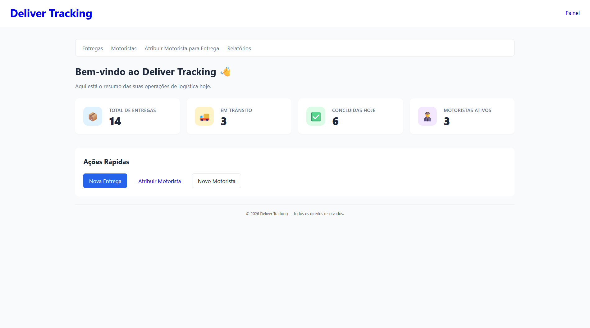
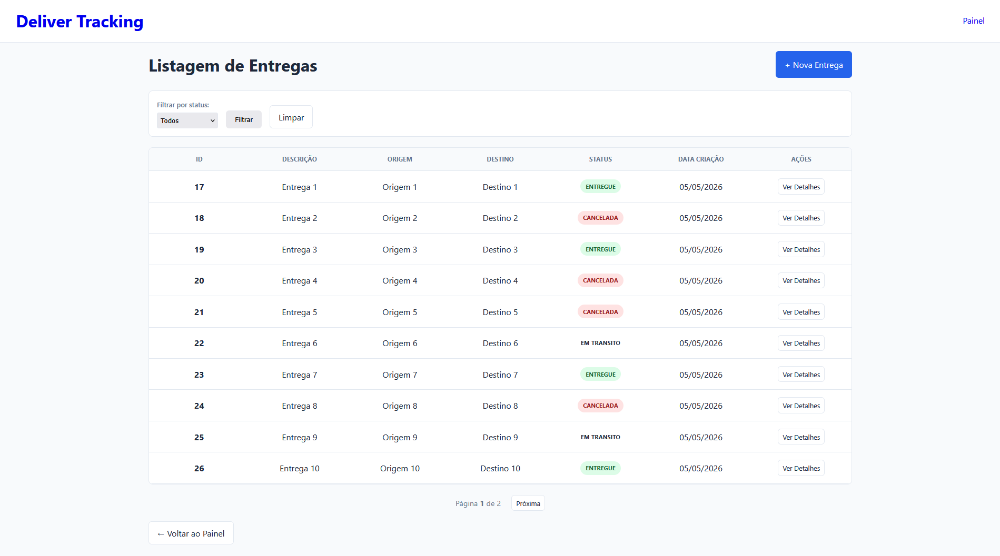
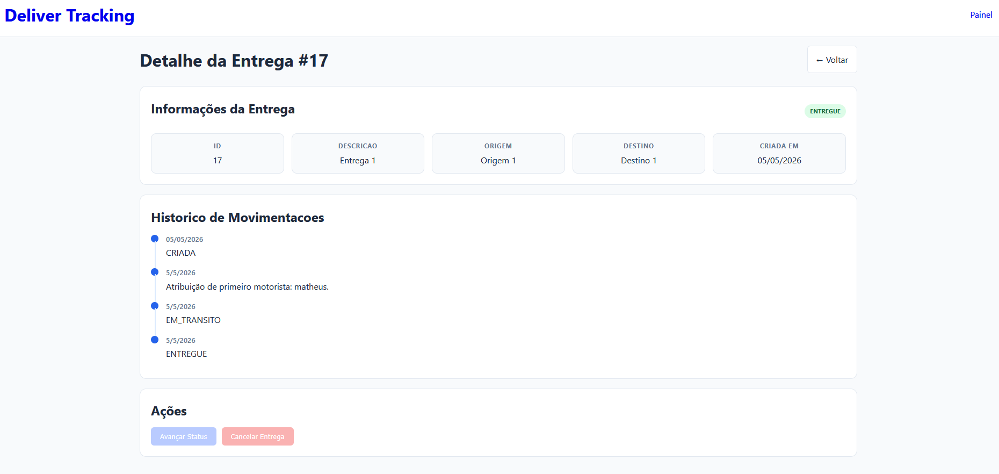
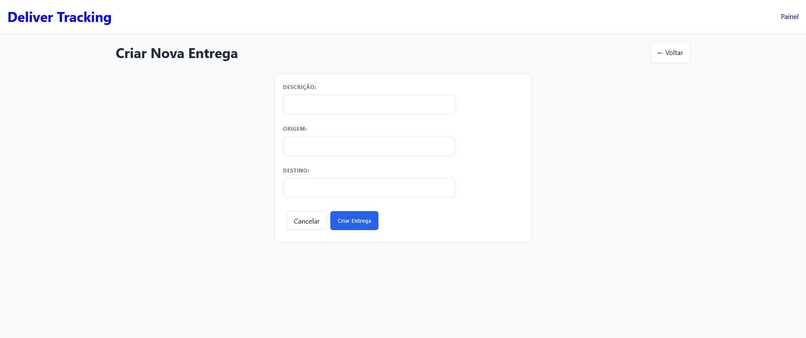
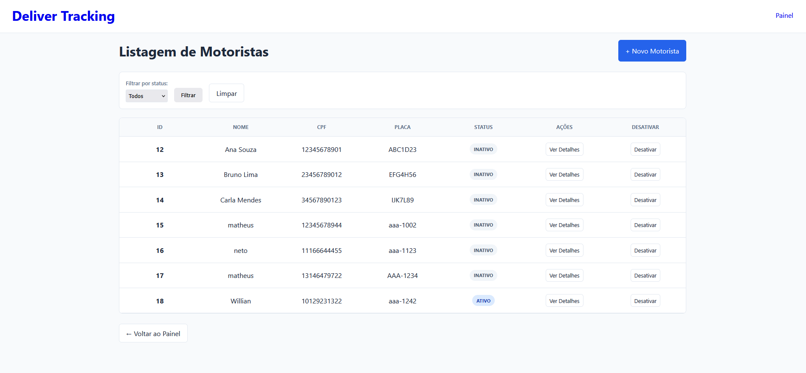
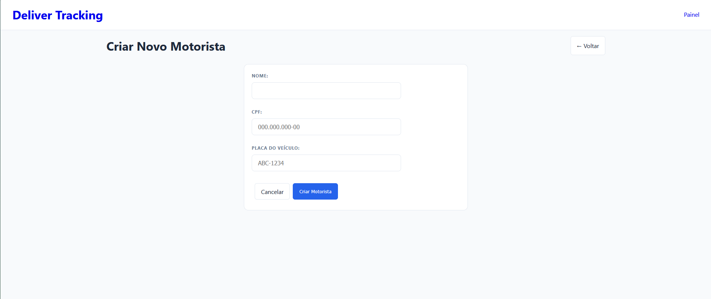
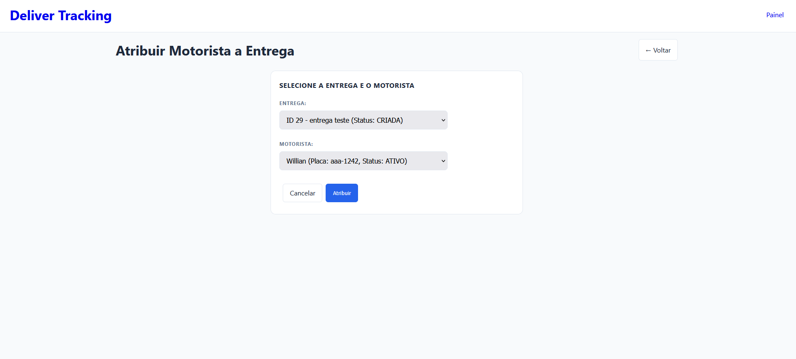
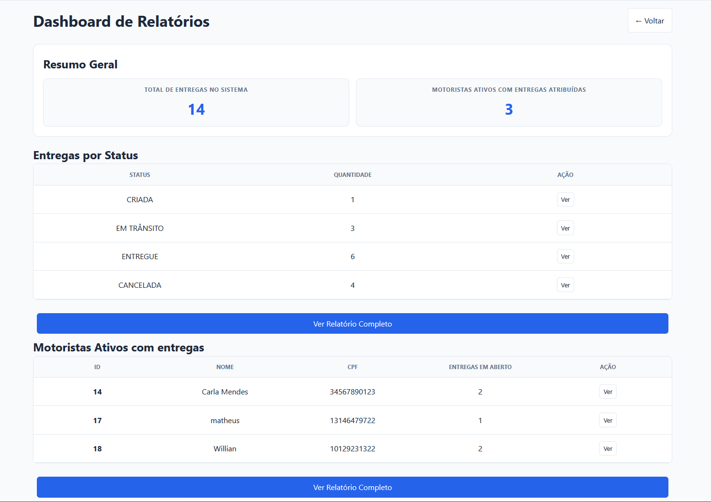

::: {.callout-note icon=false}
## Status do Projeto: **Ativo / Em desenvolvimento**
Este projeto acadêmico foi desenvolvido para explorar padrões de arquitetura avançados no ecossistema Node.js, com foco em escalabilidade e manutenção de software.
:::

## O Projeto

A **Deliver Tracking API** foi concebida para gerenciar fluxos logísticos complexos. O sistema permite o controle total sobre motoristas e entregas, garantindo que cada etapa do transporte seja documentada e validada conforme regras de negócio rigorosas.

O foco principal deste desenvolvimento foi a aplicação de **Padrões Arquiteturais (Design Patterns)** e princípios de desenvolvimento de software. Diferente de um CRUD comum, esta aplicação utiliza uma estrutura em camadas que separa as responsabilidades de entrada, processamento e persistência de dados.

---

## O acesso a plataforma

A aplicação possui uma interface administrativa robusta renderizada via **Server-Side Rendering (SSR)**. Ao acessar a rota `/painel`, o gestor é apresentado a uma tela inicial no formato de dashborad intuitivo.

{.lightbox group="gallery" width="100%" fig-align="center"}

Para as entregas, é possível realizar sua consulta por filtros específicos, assim como criação de novas entregas, com validações de origem e destino.

{.lightbox group="gallery" width="100%" fig-align="center"}

As entregas tem seu estado gerenciado por meio de uma interface específica que permite sua manipulação.

{.lightbox group="gallery" width="100%" fig-align="center"}

A criação das entregas ocorre por meio de um formulário simples.

{.lightbox group="gallery" width="100%" fig-align="center"}

Na gestão dos motoristas, é possível realizar a gestão dos registros, assim como sua consulta, por meio de interfaces semelhantes as das entregas.

{.lightbox group="gallery" width="100%" fig-align="center"}

A criação de motoristas segue uma interface semelhante a da criação de entregas.

{.lightbox group="gallery" width="100%" fig-align="center"}

Um motorista pode ser atribuído para uma entrega, o uqe cria uma relação direta.

{.lightbox group="gallery" width="100%" fig-align="center"}

Por fim, o sistema também fornece relatórios automáticos que quantificam a eficiência da operação, mostrando quantas entregas foram concluídas ou canceladas em um determinado período.

{.lightbox group="gallery" width="100%" fig-align="center"}

---

## Funcionalidades Principais

* Gestão completa de motoristas (Cadastro, Listagem e Inativação).
* Máquina de estados para entregas (CRIADA, EM_TRANSITO, ENTREGUE, CANCELADA).
* Registro automático de histórico de eventos para cada mudança de status.
* Painel administrativo (SSR) integrado para gestão visual.
* API REST documentada para integrações externas.
* Filtros avançados e paginação em rotas de listagem.

---

## Stack Tecnológica

::: {.list-table}

- - **Frontend**
  - EJS (Template Engine), CSS3, Bootstrap.

- - **Backend**
  - Node.js, Express.

- - **Persistência & ORM**
  - Prisma ORM, SQLite.

- - **Arquitetura**
  - Repository Pattern, Inversão de Dependência (DI).

- - **Padronização**
  - EJS <--> Controller -> Service -> Repository.

:::

## Desafios Técnicos & Soluções

### 1. Inversão de Dependência e Desacoplamento

Garantir que a lógica de negócio (Services) não dependesse diretamente da implementação do banco de dados foi um ponto crucial.
Implementação da **Inversão de Dependência** via interfaces/contratos. O serviço recebe o repositório através do construtor, o que permite que a infraestrutura (Prisma/SQLite) possa ser substituída por qualquer outro banco ou ORM sem alterar uma única linha da regra de negócio.

### 2. Consistência na Máquina de Estados

Impedir que uma entrega pulasse etapas (ex: de "Criada" direto para "Entregue" sem passar por "Em Trânsito") era vital para a integridade do sistema.
Criação de camadas de validação nos *Services* que utilizam códigos de status específicos, como o **HTTP 422 (Unprocessable Entity)**. Cada transição é validada antes de ser persistida, e qualquer tentativa de quebra de fluxo dispara um erro semântico detalhado.

### 3. Histórico de Eventos Automatizado

Manter um log de quem fez o quê e quando, sem sobrecarregar o código do controlador.
Estruturamos a persistência para que, a cada mudança de estado da entrega, um registro no `HistoricoEntregas` seja criado automaticamente dentro da transação do banco de dados. Isso garante **auditabilidade** do processo logístico.